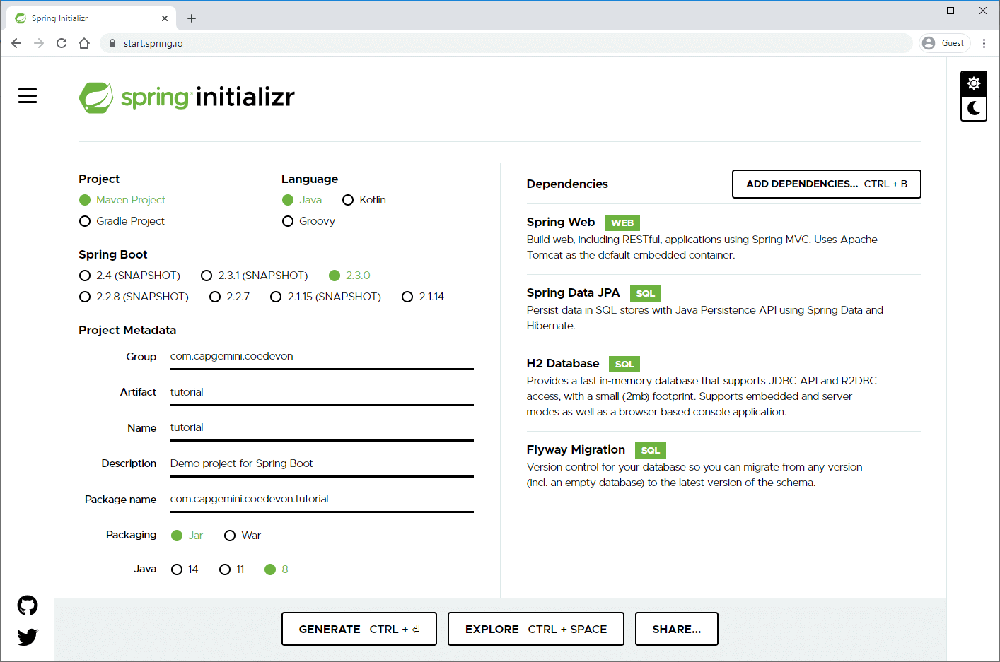
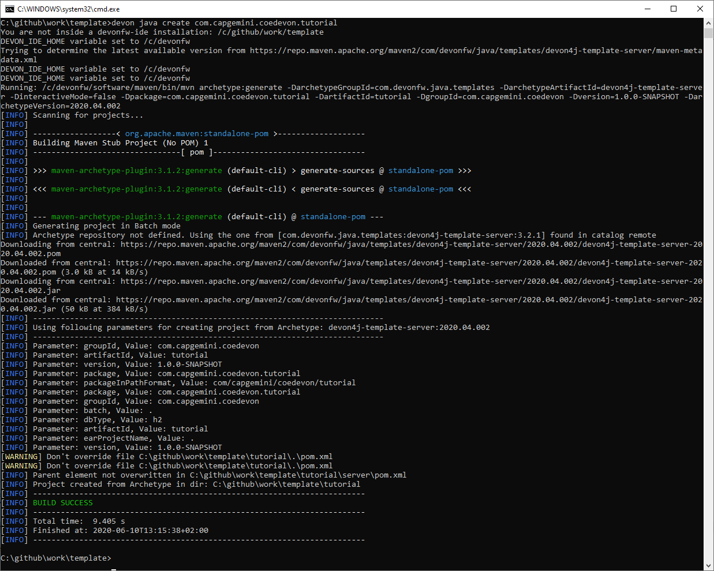

# Creación de proyecto

Por lo general necesitaremos un mínimo de dos proyectos para desarrollar una aplicación:

* Por un lado tendremos un proyecto Springboot que se ejecutará en un servidor de aplicaciones, tipo Tomcat. Este proyecto tendrá la lógica de negocio de las operaciones, el acceso a los datos de la BBDD y cualquier integración con servicios de terceros. La forma de exponer estas operaciones de negocio será mediante endpoints de acceso, en concreto llamadas tipo REST.
* Por otro lado tendremos un proyecto Angular que se ejecutará en un servidor web de ficheros estáticos, tipo Apache. Este proyecto será código javascript, css y html, que se ejecutará en el navegador Web y que realizará ciertas operaciones sencillas y validaciones en local y llamadas a nuestro servidor Springboot para ejecutar las operaciones de negocio.

Puede haber otro tipo de proyectos dentro de la aplicación, sobretodo si están basados en microservicios o tienen componentes batch, pero estos tipos los veremos en el tutorial.

!!! tip "Consejo"
    Como norma cada uno de los proyectos que componen la aplicación, debería estar conectado a un repositorio de código diferente para poder evolucionar y trabajar con cada uno de ellos de forma aislada sin afectar a los demás. Así además podemos tener equipos aislados que trabajen con cada uno de los proyectos por separado.

!!! info "Info"
    Durante todo el tutorial, voy a intentar separar la construcción del proyecto Angular de la construcción del proyecto Springboot, para terminar haciendo una integración entre los dos. De esta forma podrás comprobar como se puede desarrollar por separado cada uno de los dos proyectos sin ningún problema.

## ** Creación de proyecto Angular **

La mayoría de los proyectos con Angular en los que trabajamos normalmente, suelen ser proyectos web usando las librerías mas comunes de angular, como angular material.

Para crear un proyecto de Angular, es necesario tener instalado el CLI de Angular. Si no lo tienes instalado, por favor, acude a la sección `Entorno de desarrollo` y verifica que tienes instalado todo lo necesario.

### Nuevo proyecto

Lo primero es crear un proyecto desde la consola mediante la herramienta Angular CLI.
Para ello abrimos una consola, nos situamos en el directorio donde vamos a crear el proyecto y ejecutamos:

    ng new tutorial

Nos realizará varias preguntas.

> Would you like to add Angular routing? (y/N)

>  `Preferiblemente: y`

> Which stylesheet format would you like to use?

>  `Preferiblemente: SCSS`

En el caso del tutorial como vamos a tener dos proyectos para nuestra aplicación (front y back), para poder seguir correctamente las explicaciones, voy a renombrar la carpeta para poder diferenciarla del otro proyecto. A partir de ahora se llamará `front`.

!!! info "Info"
    Si durante el desarrollo del proyecto necesitas añadir nuevos módulos al proyecto Angular, será necesario resolver las dependencias antes de arrancar el servidor. Esto se puede realizar mediante el gestor yarn (que es más eficiente que el propio gestio de npm), directamente en consola ejecuta el comando `yarn` y descargará e instalará las nuevas dependencias.

### Arrancar el proyecto

Para arrancar el proyecto, tan solo necesitamos ejecutar en consola el siguiente comando:

    ng serve

Angular compilará el código fuente, levantará un servidor local al que podremos acceder por defecto mediante la URL: [http://localhost:4200/](http://localhost:4200/)

Y ya podemos empezar a trabajar con Angular.

!!! tip "Comandos de Angular CLI"
    Si necesitas más información sobre los comandos que ofrece Angular CLI para poder crear aplicaciones, componentes, servicios, etc. los tienes disponibles en:
    [https://angular.io/cli#command-overview](https://angular.io/cli#command-overview)

## ** Creación de proyecto Springboot **

La mayoría de los proyectos Springboot en los que trabajamos normalmente, suelen ser proyectos web sencillos con pocas dependencias de terceros o incluso proyectos basados en microservicios que ejecutan pocas acciones.

### Creación con Devonfw

Podemos crear una estructura de proyecto con todas las dependencias activadas y configuradas a través de [devonfw](https://devonfw.com/). En el tutorial vamos a utilizar un proyecto simple de Springboot, pero queremos que conozcas que con devonfw también se puede crear. Si quieres saber más, visita el punto de `Anexo` en esta misma sección.

!!! tip "Nota"
    Está bien tener una plantilla de generación de proyecto con [Devonfw](https://devonfw.com/) a modo de ejemplo donde podamos consultar, pero es mucho más sencillo crear una aplicación vacía e ir añadiendole las necesidades de nuestro proyecto a medida que nos vayan haciendo falta. Por eso te recomendamos que pases al punto de Spring Initializr

### Creación con Spring Initilizr

Este método es mucho más recomendable si lo que quieres es tener un proyecto mínimo y sencillo, sin muchas dependencias. 

#### Spring Initializr

Spring ha creado una página interactiva que permite crear y configurar proyectos en diferentes lenguajes, con diferentes versiones de Spring Boot y añadiendole los módulos que nosotros queramos.

Esta página está disponible desde [Spring Initializr](https://start.spring.io/). Para seguir el ejemplo del tutorial, entraremos en la web y seleccionaremos los siguientes datos:

* Tipo de proyecto: Maven
* Lenguage: Java
* Versión Spring boot: 2.3.0 (o la que exista por defecto)
* Group: com.capgemini.coedevon
* ArtifactId: tutorial
* Versión Java: 8
* Dependencias: Spring Web, Spring Data JPA, H2 Database y Flyway

Esto nos generará un proyecto que ya vendrá configurado con Spring Web, Spring Data para acceder a BBDD, y H2 junto con Flyway para crear una BBDD en memoria de ejemplo con la que trabajaremos durante el tutorial.

#### Importar en eclipse

El siguiente paso, ovbiamente es descomprimir el proyecto generado e importarlo como proyecto Maven. Abrimos el eclipse, pulsamos en File → Import y seleccionamos `Existing Maven Projects`. Buscamos el proyecto y le damos a importar.

#### Configurar el proyecto

En realidad el proyecto está configurado completamente con las propiedades por defecto que vienen en Spring boot. Tan solo para poder arrancar el proyecto nos hará falta un fichero de creación de BBDD que utiliza flyway al arrancar y será necesario tenerlo disponible.

Crearemos dos ficheros, de momento en blanco, dentro de `src/main/resources/db/migration`:

* V0001__Create_Schema.sql → Será el fichero que utilizaremos para crear el esquema de BBDD
* V0002__Create_Data.sql → Será el fichero que utilizaremos para rellenar con datos iniciales el esquema de BBDD

### **Plantilla de proyecto**

Puedes descargarte una [plantilla ya construida](./assets/project-template.7z), con Sprint Initializr y configurada con los pasos que hemos visto en esta sección.

### Arrancar el proyecto

Por último ya solo nos queda arrancar el proyecto creado. Para ello buscaremos la clase `TutorialApplication.java` y con el botón derecho seleccionaremos Run As → Java Application. La aplicación al estar basada en Springboot arrancará internamente un Tomcat embebido donde se despliegará el proyecto. Si habéis seguido el tutorial la aplicación estará disponible en [http://localhost:8080](http://localhost:8080), aunque de momento aun no tenemos nada accesible.

### Anexo. Creación con Devonfw

Podemos utilizar la plantilla de creación que nos ofrece [Devonfw](https://devonfw.com/) a través de su guía de desarrollo. Concretamente podemos seguir estos pasos: [Creating a new application](https://devonfw.com/website/pages/docs/devon4j.asciidoc_tutorials.html).

El problema que tiene esta plantilla es que genera un proyecto totalmente configurado y que tiene activadas un conjunto muy grande de librerías. La mayoría de estas librerías no las utilizaremos jamás en ningún proyecto e incluso hay configuración de seguridad que tampoco vamos a utilizar por norma general o la tendremos que modificar para adaptarla a nuestra situación (proyecto, entorno, cliente, etc.).

#### Ejecución de arquetipo

Aun así, si quieres crear un proyecto con devonfw es muy sencillo, puedes seguir estos pasos:

* Nos situamos en la carpeta que queramos que contenga nuestro proyecto y ejecutamos una consola de comandos. Para ello hacemos clic derecho y seleccionamos la opción *Open devonfw CMD shell here* y se nos abrirá la consola.

* En la consola de devon, tecleamos el siguiente comando: `devon java create com.capgemini.coedevon.tutorial`.
Veremos como el propio framework se descarga todo lo necesario y en breves momentos tendremos todo listo. Esto nos creará un proyecto de devon4j, con el nombre de paquete *com.capgemini.coedevon.tutorial*, el id de grupo *com.capgemini.coedevon*, el id de artefacto *tutorial*, la versión *1.0.0-SNAPSHOT* y una base de datos **h2** ya preconfigurada.

* Una vez haya terminado, teclearemos lo siguiente:
`cd tutorial` y nos posicionará sobre la carpeta raíz del proyecto. Estando en la carpeta raíz del proyecto, tecleamos lo siguiente: `devon eclipse` y nos arrancará Eclipse.

O tambien puedes descargarte una [plantilla ya construida de devonfw.](./assets/devon4j-template.7z)
