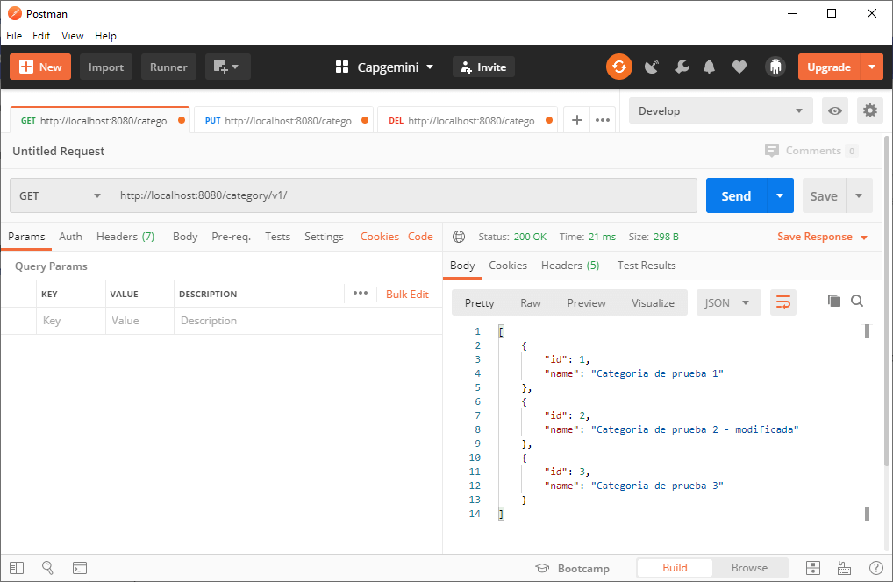
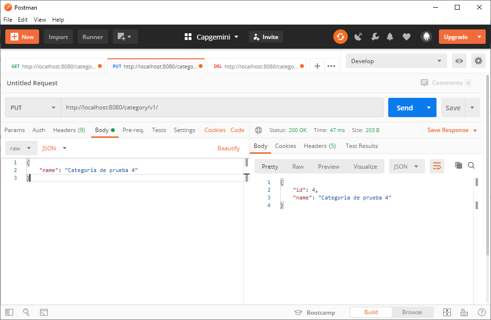
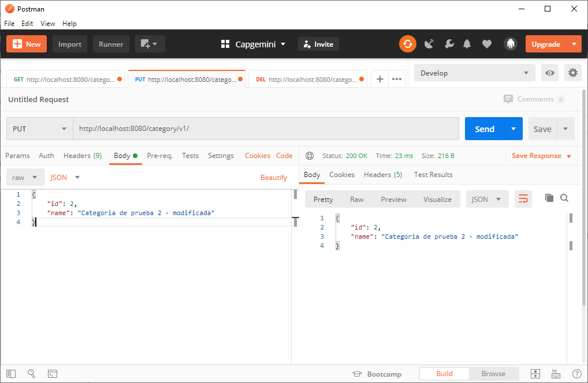
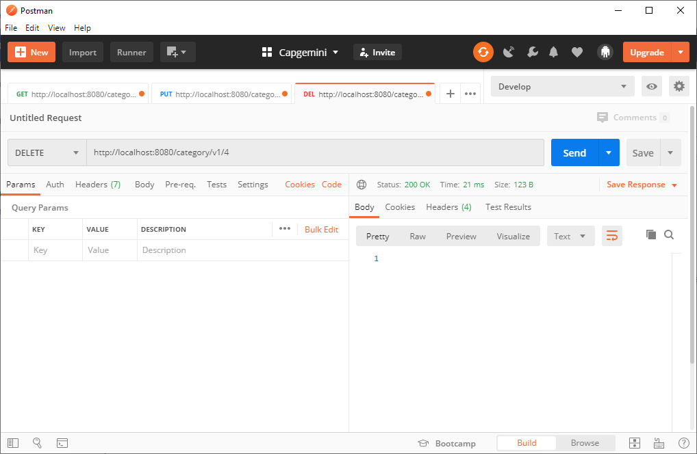
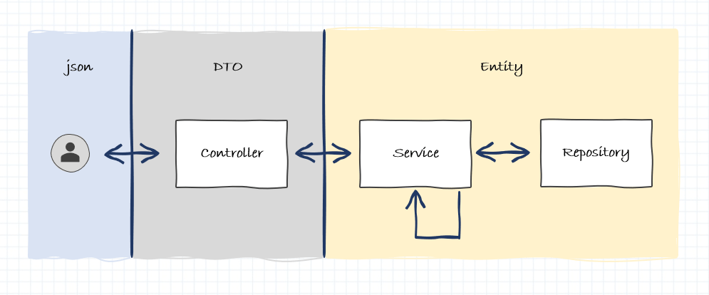

# Desarrollo con Springboot

Ahora que ya tenemos listo tanto el proyecto back de SpringBoot (en el puerto 8080) como el proyecto front de Angular (en el puerto 4200), ya podemos empezar a codificar la solución.

Durante todo el tutorial vamos a intentar separar completamente la implementación de front de la implementación de back, para que quede claro como se debe realizar en cada una de las tecnologías.

## Primeros pasos

!!! success "Antes de empezar"
    Quiero hacer hincapié en Springboot tiene una documentación muy extensa y completa, así que te recomiendo que hagas uso de ella cuando tengas cualquier duda. Tanto la propia web de [Spring](https://spring.io/projects/spring-boot) como en el portal de tutoriales de [Baeldung](https://www.baeldung.com/spring-tutorial) puedes buscar casi cualquier ejemplo que necesites.

Si has seguido el tutorial, en la creación del proyecto tenías la posibilidad de crear un proyecto Devonfw o crear un proyecto Springboot simple. Hay ciertas herramientas y configuraciones que provee Devonfw que son muy útiles a la hora de desarrollar aplicaciones y por tanto si hemos creado una aplicación Springboot deberíamos añadirlas.

### Añadir utilidades Devonfw

Lo primero que vamos a hacer es añadir las dependencias a librerías de devonfw. Abriremos el fichero `pom.xml` que nos ha generado el Spring Initilizr y añadiremos las siguientes líneas:

=== "pom.xml"
    ``` xml hl_lines="19 22 23 24 25 26 27 28 29 30 31 32 33 36 37 38 39 40 42 43 44 45 46 48 49 50 51 52 54 55 56 57 58 59"
    <?xml version="1.0" encoding="UTF-8"?>
    <project xmlns="http://maven.apache.org/POM/4.0.0" xmlns:xsi="http://www.w3.org/2001/XMLSchema-instance"
      xsi:schemaLocation="http://maven.apache.org/POM/4.0.0 https://maven.apache.org/xsd/maven-4.0.0.xsd">
      <modelVersion>4.0.0</modelVersion>
      <parent>
        <groupId>org.springframework.boot</groupId>
        <artifactId>spring-boot-starter-parent</artifactId>
        <version>2.3.0.RELEASE</version>
        <relativePath/> <!-- lookup parent from repository -->
      </parent>
      <groupId>com.capgemini.coedevon</groupId>
      <artifactId>tutorial</artifactId>
      <version>0.0.1-SNAPSHOT</version>
      <name>tutorial</name>
      <description>Demo project for Spring Boot</description>

      <properties>
        <java.version>1.8</java.version>
        <devon4j.version>2020.04.001</devon4j.version>
      </properties>

      <dependencyManagement>
        <dependencies>
          <!-- BOM of devon4j -->
          <dependency>
            <groupId>com.devonfw.java.boms</groupId>
            <artifactId>devon4j-bom</artifactId>
            <version>${devon4j.version}</version>
            <type>pom</type>
            <scope>import</scope>
          </dependency>
        </dependencies>
      </dependencyManagement>

      <dependencies>
        <!-- Bean-Mapping for conversion from TO to Entity and vice versa -->
        <dependency>
          <groupId>com.devonfw.java.modules</groupId>
          <artifactId>devon4j-beanmapping-orika</artifactId>
        </dependency>
      
        <!-- Rest Mappers -->
        <dependency>
          <groupId>com.devonfw.java.modules</groupId>
          <artifactId>devon4j-rest</artifactId>
        </dependency>
        
        <!-- JPA -->
        <dependency>
          <groupId>com.devonfw.java.starters</groupId>
          <artifactId>devon4j-starter-spring-data-jpa</artifactId>
        </dependency>

        <!--
        <dependency>
          <groupId>org.springframework.boot</groupId>
          <artifactId>spring-boot-starter-data-jpa</artifactId>
        </dependency>
        -->

        <dependency>
          <groupId>org.springframework.boot</groupId>
          <artifactId>spring-boot-starter-web</artifactId>
        </dependency>

        <dependency>
          <groupId>org.flywaydb</groupId>
          <artifactId>flyway-core</artifactId>
        </dependency>

        <dependency>
          <groupId>com.h2database</groupId>
          <artifactId>h2</artifactId>
          <scope>runtime</scope>
        </dependency>

        <dependency>
          <groupId>org.springframework.boot</groupId>
          <artifactId>spring-boot-starter-test</artifactId>
          <scope>test</scope>
          <exclusions>
            <exclusion>
              <groupId>org.junit.vintage</groupId>
              <artifactId>junit-vintage-engine</artifactId>
            </exclusion>
          </exclusions>
        </dependency>
      </dependencies>

      <build>
        <plugins>
          <plugin>
            <groupId>org.springframework.boot</groupId>
            <artifactId>spring-boot-maven-plugin</artifactId>
          </plugin>
        </plugins>
      </build>

    </project>
    ```

Ojo, que hemos sustituido la dependencia de Spring-JPA por la dependencia de Devonfw-JPA ya que nos permite utilizar más funcionalidades extendidas sobre repositorios JPA. Además de esa dependencia, hemos añadido una utilidad para hacer mapeos entre objetos y para configurar los servicios Rest.

### Configurar utilidades Devonfw

El siguiente punto es crear las clases de configuración para las librerías que hemos añadido. Para ello vamos a crear un package de configuración general de la aplicación `com.capgemini.coedevon.tutorial.config` donde crearemos tres clases (dos de ellas dentro del subpaquete `mapper`).

=== "BeansOrikaConfig.java"
    ``` Java
    package com.capgemini.coedevon.tutorial.config;

    import org.springframework.context.annotation.Bean;
    import org.springframework.context.annotation.Configuration;

    import com.capgemini.coedevon.tutorial.config.mapper.BeanMapper;
    import com.capgemini.coedevon.tutorial.config.mapper.BeanMapperImpl;
    import com.devonfw.module.beanmapping.common.base.BaseOrikaConfig;
    import com.devonfw.module.json.common.base.ObjectMapperFactory;
    import com.fasterxml.jackson.databind.Module;

    import ma.glasnost.orika.MapperFactory;

    /**
    * Java bean configuration for Orika. The method {@link #configureCustomMapping(MapperFactory)} from
    * {@link BaseOrikaConfig} can be overridden as per requirements.
    */
    @Configuration
    public class BeansOrikaConfig extends BaseOrikaConfig {

      /**
      * @return the {@link BeanMapper} implementation.
      */
      @Override
      @Bean
      public BeanMapper getBeanMapper() {

        return new BeanMapperImpl();
      }

      @Bean
      public Module configureObjectMapper() {

        ObjectMapperFactory objectMapper = new ObjectMapperFactory();
        return objectMapper.getExtensionModule();

      }

    }
    ```
=== "mapper/BeanMapper.java"
    ``` Java
    package com.capgemini.coedevon.tutorial.config.mapper;

    import org.springframework.data.domain.Page;

    /**
    * @author coedevon
    */
    public interface BeanMapper extends com.devonfw.module.beanmapping.common.api.BeanMapper {

      /**
      * Mapea el genérico de un Page en otro tipo de genérico
      * @param <T>
      * @param source
      * @param targetClass
      * @return
      */
      <T> Page<T> mapPage(Page source, Class<T> targetClass);

    }
    ```
=== "mapper/BeanMapperImpl.java"
    ``` Java
    package com.capgemini.coedevon.tutorial.config.mapper;

    import java.util.List;

    import org.springframework.data.domain.Page;
    import org.springframework.data.domain.PageImpl;

    import com.devonfw.module.beanmapping.common.impl.orika.BeanMapperImplOrika;

    /**
    * @author coedevon
    */
    public class BeanMapperImpl extends BeanMapperImplOrika implements BeanMapper {

      /**
      * {@inheritDoc}
      */
      public <T> Page<T> mapPage(Page source, Class<T> targetClass) {

        if (source == null) {
          return null;
        }

        List list = mapList(source.getContent(), targetClass);

        return new PageImpl<>(list, source.getPageable(), source.getTotalElements());
      }

    }
    ```

Listo, ya podemos empezar a desarrollar nuestros servicios.

## Estructurar el código

Vamos a hacer un breve refresco de la estructura del código que ya se ha visto en puntos anteriores.

Las clases deben estar agrupadas por ámbito funcional, en nuestro caso como vamos a hacer la funcionalidad de `Categorías` pues debería estar todo dentro de un package del tipo `com.capgemini.coedevon.tutorial.category`.

Además, deberíamos aplicar la separación por capas como ya se vió en el esquema:


La primera capa, la de `Controlador`, se encargará de procesar las peticiones y transformar datos. Esta capa llamará a la capa de `Lógica` de negocio que ejecutará las operaciones, ayudándose de otros objetos de esa misma capa de `Lógica` o bien de llamadas a datos a través de la capa de `Acceso a Datos`

Ahora sí, vamos a programar!.

## Capa de operaciones: Controller

En esta capa es donde se definen las operaciones que pueden ser consumidas por los clientes. Se caracterizan por estar anotadas con las anotaciones @Controller o @RestController y por las anotaciones @RequestMapping que nos permiten definir las rutas de acceso.

### Controller de ejemplo

Vamos a crear una clase `CategoryController.java` dentro del package `com.capgemini.coedevon.tutorial.category` para definir las rutas de las operaciones.

=== "CategoryController.java"
    ``` Java
    package com.capgemini.coedevon.tutorial.category;

    import java.util.List;

    import org.springframework.beans.factory.annotation.Autowired;
    import org.springframework.web.bind.annotation.RequestMapping;
    import org.springframework.web.bind.annotation.RequestMethod;
    import org.springframework.web.bind.annotation.RestController;

    /**
    * @author coedevon
    */
    @RequestMapping(value = "/category/v1")
    @RestController
    public class CategoryController {

      /**
      * Método para recuperar todas las Category
      * @return
      */
      @RequestMapping(path = "/", method = RequestMethod.GET)
      public String prueba() {

        return "Probando el Controller";
      }

    }
    ```

Si abrimos el [Postman](https://www.postman.com/) y creamos una petición GET a la url http://localhost:8080/category/v1/ nos responderá con el mensaje que hemos puesto.

### Implementar operaciones

Ahora que ya tenemos un controlador y una operacion de negocio ficticia, vamos a borrarla y añadir las operaciones reales que consumirá nuestra pantalla. Deberemos añadir una operación para listar, una para actualizar, una para guardar y una para borrar. Aunque para hacerlo más cómodo, utilizaremos la misma operación para guardar y para actualizar. Además, no estar trabajando con tipos simples, vamos a utilizar un objeto para recibir información y para enviar información.

Estos objetos típicamente se denominan DTO (Data Transfer Object) y nos sirven justamente para encapsular información que queremos transportar. En realidad no son más que clases pojo sencilla con propiedades y getters y setters. 

Para nuestro ejemplo crearemos una clase `CategoryDto` dentro del package `com.capgemini.coedevon.tutorial.category.model` con el siguiente contenido:

=== "CategoryDto.java"
    ``` Java
    package com.capgemini.coedevon.tutorial.category.model;

    /**
    * @author coedevon
    */
    public class CategoryDto {
      private Long id;

      private String name;

      /**
      * @return id
      */
      public Long getId() {

        return this.id;
      }

      /**
      * @param id new value of {@link #getId}.
      */
      public void setId(Long id) {

        this.id = id;
      }

      /**
      * @return name
      */
      public String getName() {

        return this.name;
      }

      /**
      * @param name new value of {@link #getName}.
      */
      public void setName(String name) {

        this.name = name;
      }

    }
    ```

A continuación utilizaremos esta clase en nuestro Controller para implementar las tres operaciones de negocio.

=== "CategoryController.java"
  ``` Java
  package com.capgemini.coedevon.tutorial.category;

  import java.util.ArrayList;
  import java.util.HashMap;
  import java.util.List;
  import java.util.Map;

  import org.springframework.web.bind.annotation.PathVariable;
  import org.springframework.web.bind.annotation.RequestBody;
  import org.springframework.web.bind.annotation.RequestMapping;
  import org.springframework.web.bind.annotation.RequestMethod;
  import org.springframework.web.bind.annotation.RestController;

  import com.capgemini.coedevon.tutorial.category.model.CategoryDto;

  /**
  * @author coedevon
  */
  @RequestMapping(value = "/category/v1")
  @RestController
  public class CategoryController {

    private long SEQUENCE = 1;
    private Map<Long, CategoryDto> categories = new HashMap<Long, CategoryDto>();

    /**
    * Método para recuperar todas las Category
    * @return
    */
    @RequestMapping(path = "/", method = RequestMethod.GET)
    public List<CategoryDto> findAll() {

      return new ArrayList(this.categories.values());
    }

    /**
    * Método para crear o actualizar una Category
    * @param dto
    * @return
    */
    @RequestMapping(path = "/", method = RequestMethod.PUT)
    public CategoryDto save(@RequestBody CategoryDto dto) {

      CategoryDto category = this.categories.get(dto.getId());

      if (category == null) {
        category = new CategoryDto();
        category.setId(this.SEQUENCE++);
        this.categories.put(category.getId(), category);
      }

      category.setName(dto.getName());

      return category;
    }

    /**
    * Método para borrar una Category
    * @param id
    */
    @RequestMapping(path = "/{id}", method = RequestMethod.DELETE)
    public void delete(@PathVariable("id") Long id) {

      this.categories.remove(id);
    }
  }
  ```

Como todavía no tenemos acceso a BD, hemos creado una variable tipo HashMap y una variable Long, que simularán una BD y una secuencia. También hemos implementado tres operaciones GET, PUT y DELETE que realizan las acciones necesarias por nuestra pantalla. Ahora podríamos probarlo desde el Postman con cuatro ejemplo sencillos.

!!! tip "Atención"
    Los datos que se reciben pueden venir informados como un parámetro en la URL Get, como una variable en el propio path o dentro del body de la petición. Cada uno de ellos se recupera con una anotación especial: `@RequestParam`, `@PathVariable` y `@RequestBody` respectivamente.

**GET** nos devuelve un listado de `Categorías`



**PUT** nos sirve para insertar `Categorías` nuevas (si no tienen el id informado) o para actualizar `Categorías` (si tienen el id informado). Fíjate que los datos que se reciben están en el body.




**DELETE** nos sirve eliminar `Categorías`. Fíjate que el dato del ID está en el path.



### Aspectos importantes

Los aspectos importantes de la capa `Controller` son:

* La clase debe estar anotada con `@Controller` o `@RestController`. Mejor usar la última anotación ya que estás diciendo que las operaciones son de tipo Rest y no hará falta configurar nada
* La ruta general al controlador se define con el `@RequestMapping` global de la clase, aunque también se puede obviar esta anotación y añadir a cada una de las operaciones la ruta raíz.
* Importante, a modo de consejo, anadir en la ruta la versión de la API (en nuestro ejemplo v1). Esto nos ayudará a ampliarla y cambiar la funcionalidad a futuro:
    * Cualquier modificación del algoritmo que no afecte al contrato o cualquier operación nueva, puede ir en la misma versión
    * Eliminaciones y modificaciones de contrato, deberían ir en un `Controller` nuevo anotado con otra versión (`category/v2/` por ejemplo)
* Los métodos que queramos exponer como operaciones deben ir anotados también con `@RequestMapping` con la info:
    * `path` → Que nos permite definir un path para la operación, siempre sumándole el path de la clase (si es que tuviera)
    * `method` → Que nos permite definir el verbo de http que vamos a atender. Podemos tener el mismo path con diferente method, sin problema. Por lo general utilizaremos:
        * *GET* → Generalmente se usa para recuperar información
        * *POST* → Se utiliza para hacer update y filtrados complejos de información
        * *PUT* → Se utiliza para hacer save de información
        * *DELETE* → Se utiliza para hacer borrados de información

## Capa de Servicio: Service

Pero en realidad la cosa no funciona así. Hemos implementado parte de la lógica de negocio (las operaciones/acciones de guardado, borrado y listado) dentro de lo que sería la capa de operaciones o servicios al cliente. Esta capa no debe ejecutar lógica de negocio, tan solo debe hacer transformaciones de datos y enrutar peticiones, toda la lógica debería ir en la capa de servicio.

### Implementar servicios

Pues vamos a arreglarlo. Vamos a crear un servicio y vamos a mover la lógica de negocio al servicio.

=== "CategoryService.java"
    ``` Java
    package com.capgemini.coedevon.tutorial.category;

    import java.util.List;

    import com.capgemini.coedevon.tutorial.category.model.CategoryDto;

    /**
    * @author coedevon
    *
    */
    public interface CategoryService {

      /**
      * Método para recuperar todas las Category
      * @return
      */
      List<CategoryDto> findAll();

      /**
      * Método para crear o actualizar una Category
      * @param dto
      * @return
      */
      CategoryDto save(CategoryDto dto);

      /**
      * Método para borrar una Category
      * @param id
      */
      void delete(Long id);
    }
    ```
=== "CategoryServiceImpl.java"
    ``` Java
    package com.capgemini.coedevon.tutorial.category;

    import java.util.ArrayList;
    import java.util.HashMap;
    import java.util.List;
    import java.util.Map;

    import org.springframework.stereotype.Service;

    import com.capgemini.coedevon.tutorial.category.model.CategoryDto;

    /**
    * @author coedevon
    *
    */
    @Service
    public class CategoryServiceImpl implements CategoryService {
      private long ID = 1;

      private Map<Long, CategoryDto> categories = new HashMap<Long, CategoryDto>();

      /**
      * Método para recuperar todas las Category
      * @return
      */
      public List<CategoryDto> findAll() {

        return new ArrayList(this.categories.values());
      }

      /**
      * Método para crear o actualizar una Category
      * @param dto
      * @return
      */
      public CategoryDto save(CategoryDto dto) {

        CategoryDto category = this.categories.get(dto.getId());

        if (category == null) {
          category = new CategoryDto();
          category.setId(this.ID++);
          this.categories.put(category.getId(), category);
        }

        category.setName(dto.getName());

        return category;
      }

      /**
      * Método para borrar una Category
      * @param id
      */
      public void delete(Long id) {

        this.categories.remove(id);
      }
    }
    ```
=== "CategoryController.java"
    ``` Java
    package com.capgemini.coedevon.tutorial.category;

    import java.util.List;

    import org.springframework.beans.factory.annotation.Autowired;
    import org.springframework.web.bind.annotation.PathVariable;
    import org.springframework.web.bind.annotation.RequestBody;
    import org.springframework.web.bind.annotation.RequestMapping;
    import org.springframework.web.bind.annotation.RequestMethod;
    import org.springframework.web.bind.annotation.RestController;

    import com.capgemini.coedevon.tutorial.category.model.CategoryDto;

    /**
    * @author coedevon
    */
    @RequestMapping(value = "/category/v1")
    @RestController
    public class CategoryController {

      @Autowired
      private CategoryService categoryService;

      /**
      * Método para recuperar todas las Category
      * @return
      */
      @RequestMapping(path = "/", method = RequestMethod.GET)
      public List<CategoryDto> findAll() {

        return this.categoryService.findAll();
      }

      /**
      * Método para crear o actualizar una Category
      * @param dto
      * @return
      */
      @RequestMapping(path = "/", method = RequestMethod.PUT)
      public CategoryDto save(@RequestBody CategoryDto dto) {

        return this.categoryService.save(dto);
      }

      /**
      * Método para borrar una Category
      * @param id
      */
      @RequestMapping(path = "/{id}", method = RequestMethod.DELETE)
      public void delete(@PathVariable("id") Long id) {

        this.categoryService.delete(id);
      }
    }
    ```

Ahora ya tenemos bien estructurado nuestro proyecto. Ya tenemos las dos capas necesarias Controladores y Servicios y cada uno se encarga de llevar a cabo su cometido de forma correcta.


### Aspectos importantes

Los aspectos importantes de la capa `Service` son:

* Toda la lógica de negocio, operaciones y demás debe estar implementada en los servicios. Los controladores simplemente invocan servicios y transforman ciertos datos.
* Es buena práctica que la capa de servicios se implemente usando el patrón fachada, esto quiere decir que necesitamos tener una Interface y al menos una implementación de esa Interface. Y siempre siempre debemos interactuar con la Interface. Esto nos permitirá a futuro poder sustituir la implementación por otra diferente sin que el resto del código se vea afectado. Especialmente útil cuando queremos mockear comportamientos en tests.
* La capa de servicio puede invocar a otros servicios en sus operaciones, pero **nunca** debe invocar a un controlador.
* Para crear un servicio se debe anotar mediante `@Service` y además debe implementar la Interface del servicio. Un error muy común al arrancar un proyecto y ver que no funcionan las llamadas, es porqué no existe la anotación `@Service` o porqué no se ha implementado la Interface.
* La forma de `inyectar` y utilizar componentes manejados por Springboot es mediante la anotación `@Autowired`. **NO** intentes crear un objeto de CategoryServiceImpl, ni hacer un `new`, ya que no estará manejado por Springboot y dará fallos de NullPointer. Lo mejor es dejar que Springboot lo gestione y utilizar las inyecciones de dependencias.


## Capa de Datos: Repository

Pero no siempre vamos a acceder a los datos mediante un HasMap en memoria. En algunas ocasiones queremos que nuestro proyecto acceda a un servicio de datos como puede ser una BBDD, un servicio externo, un acceso a disco, etc.
Estos accesos se deben hacer desde la capa de acceso a datos, y en concreto para nuestro ejemplo, lo haremos a través de un Repository para que acceda a una BBDD.

### Creación de BBDD

Para el tutorial no necesitamos configurar una BBDD externa ni complicarnos demasiado. Vamos a utilizar una librería muy útil llamada `H2` que nos permite levantar una BBDD en memoria persistiendo los datos en memoria o en disco y vamos a utilizar las librerías de `flyway` para crear nuestro esquema de BBDD en el arranque de la aplicación.

Para esto, si te acuerdas de cuando creamos la aplicación, existen unos ficheros que se encuentran dentro de la carpeta `src/main/resources/db/migration/` y que nos permiten ir depositando scripts versionados para que se ejecuten en orden una vez se levante la aplicación. Vamos a crear los nuestros:

=== "V0001__Create_Schema.sql"
    ``` SQL
    CREATE SEQUENCE HIBERNATE_SEQUENCE START WITH 1000000;

    DROP TABLE IF EXISTS CATEGORY;

    CREATE TABLE CATEGORY (
      id BIGINT AUTO_INCREMENT PRIMARY KEY,
      name VARCHAR(250) NOT NULL
    );
    ```
=== "V0002__Create_Data.sql"
    ``` SQL
    INSERT INTO CATEGORY(id, name) VALUES (1, 'Eurogames');
    INSERT INTO CATEGORY(id, name) VALUES (2, 'Ameritrash');
    INSERT INTO CATEGORY(id, name) VALUES (3, 'Familiar');
    ```

La creación de la secuencia de hibernate es necesaria para que H2 pueda trabajar con ID auto incrementales. De lo contrario al arrancar la aplicación se quejará.

### Implementar Entity

Una vez creada la BBDD el siguiente paso es crear la entidad con la que vamos a persistir y recuperar información. Las entidades igual que los DTOs deberían estar agrupados dentro del package `model` de cada funcionalidad, así que vamos a crear una nueva clase java.

=== "Category.java"
    ``` Java
    package com.capgemini.coedevon.tutorial.category.model;

    import javax.persistence.Column;
    import javax.persistence.Entity;
    import javax.persistence.GeneratedValue;
    import javax.persistence.GenerationType;
    import javax.persistence.Id;
    import javax.persistence.Table;

    /**
    * @author coedevon
    */
    @Entity
    @Table(name = "Category")
    public class Category {

      @Id
      @GeneratedValue(strategy = GenerationType.AUTO)
      @Column(name = "id", nullable = false)
      private Long id;

      @Column(name = "name", nullable = false)
      private String name;

      /**
      * @return id
      */
      public Long getId() {

        return this.id;
      }

      /**
      * @param id new value of {@link #getId}.
      */
      public void setId(Long id) {

        this.id = id;
      }

      /**
      * @return name
      */
      public String getName() {

        return this.name;
      }

      /**
      * @param name new value of {@link #getName}.
      */
      public void setName(String name) {

        this.name = name;
      }

    }
    ```

Si te fijas, la Entity suele ser muy similar a un DTO, tiene unas propiedades y sus getters y setters. Pero a diferencia de los DTOs, esta clase tiene una serie de anotaciones que permiten a JPA hacer su magia y generar consultas SQL a la BBDD. En este ejemplo vemos 4 anotaciones importantes:

* `@Entity` → Le indica a Springboot que se trata de una clase que implementa una Entidad de BBDD. Sin esta anotación no es posible hacer queries.
* `@Table` → Le indica a JPA el nombre y el schema de la tabla que representa esta clase. Por claridad se debería poner siempre, aunque si el nombre de la tabla es igual al nombre de la clase no es necesaria la anotación.
* `@Id` y `@GeneratedValue` → Le indica a JPA que esta propiedad es la que mapea una Primary Key y además que esta PK se genera con la estrategia que se le indique en la anotación `@GeneratedValue`, que puede ser:
    * Generación de PK por `Secuence`, la que utiliza Oracle, en este caso habrá que indicarle un nombre de secuencia.
    * Generación de PK por `Indentity`, la que utiliza MySql o SQLServer, el auto-incremental. 
    * Generación de PK por `Table`, en algunas BBDD se permite tener una tabla donde se almacenan como registros todas las secuencias.
    * Generación de PK `Auto`, elige la mejor estrategia en función de la BBDD que hemos seleccionado.
* `@Column` → Le indica a JPA que esta propiedad mapea una columna de la tabla y le especifica el nombre de la columna. Al igual que la anotaciónd de `Table`, esta anotación no es necesaria aunque si es muy recomendable. Por claridad se debería poner siempre, aunque si el nombre de la columna es igual al nombre de la propiedad no es necesaria la anotación.

Hay muchas otras anotaciones, pero estas son las básicas, ya irás aprendiendo otras.

!!! tip "Consejo"
    Para definir las PK de las tablas, intenta evitar una PK compuesta de más de una columna. La programación se hace muy compleja y las magias que hace JPA en la oscuridad se complican mucho. Mi recomendación es que siempre utilices una PK númerica, en la medida de lo posible, y si es necesario, crees índices compuestos de búsqueda o checks compuestos para evitar duplicidades.

### Implementar Repository

Ahora que ya tenemos la entidad implementada, vamos a utilizarla para acceder a BBDD, y esto lo haremos con un `Repository`. Existen varias formas de utilizar los repositories, desde el todo automático y magia de JPA hasta el repositorio manual en el que hay que codificar todo. En el tutorial voy a explicar varias formas de implementarlo para este CRUD y los siguientes CRUDs.

Como ya se dijo en puntos anteriores, el acceso a datos se debe hacer siempre a través de un `Repository`, así que vamos a implementar uno. En esta capa, al igual que pasaba con los services, es recomendable utilizar el patrón fachada, para poder sustituir implementaciones sin afectar al código.

=== "CategoryRepository.java"
    ``` Java
    package com.capgemini.coedevon.tutorial.category;

    import org.springframework.data.repository.CrudRepository;

    import com.capgemini.coedevon.tutorial.category.model.Category;

    /**
    * @author coedevon
    */
    public interface CategoryRepository extends CrudRepository<Category, Long> {

    }
    ```

¿Que te parece?, sencillo, ¿no?. Spring ya tiene una implementación por defecto de un CrudRepository, tan solo tenemos que crear una interface que extienda de la interface `CrudRepository` pasandole como tipos la `Entity` y el tipo de la Primary Key. Con eso Spring construye el resto y nos provee de los métodos típicos y necesarios para un CRUD.

Ahora vamos a utilizarla en el `Service`, pero hay un problema. El `Repository` devuelve un objeto tipo `Category` y el `Service` y `Controller` devuelven un objeto tipo `CategoryDto`. Esto es porque en cada capa se debe con un ámbito de modelos diferente. Podríamos hacer que todo el back trabajara con `Category` que son entidades de persistencia, pero no es lo correcto y nos podría llevar a cometer errores, o modificar el objeto y que sin que nosotros lo ordenásemos se persistiera ese cambio en BBDD.

El ámbito de trabajo  de las capas con el que solemos trabajar y está más extendido es el siguiente:



* Los datos que vienen y van al cliente, deberían ser en la mayoría de los casos datos en formato json
* Al entrar en un `Controller` esos datos json se transforman en un DTO. Al salir del `Controller` hacia el cliente, esos DTOs se transforman en formato json. Estas conversiones son automáticas, las hace Springboot (en realidad las hace la librería de jackson codehaus).
* Cuando un `Controller` ejecuta una llamada a un `Service`, generalmente le pasa sus datos en DTO, y el `Service` se encarga de transformar esto a una `Entity`. A la inversa, cuando un `Service` responde a un `Controller`, él responde con una `Entity` y el `Controller` ya se encargará de transformarlo a DTO.
* Por último, para los `Repository`, siempre se trabaja de entrada y salida con objetos tipo `Entity`

Parece un lio, pero ya verás como es muy sencillo ahora que veremos el ejemplo. Una última cosa, para hacer esas transformaciones, las podemos hacer a mano usando getters y setters o bien utilizar el objeto `BeanMapper` que hemos configurado al principio como utilidad de Devonfw.

El código debería quedar así:

=== "CategoryServiceImpl.java"
    ``` Java
    package com.capgemini.coedevon.tutorial.category;

    import java.util.List;

    import org.springframework.beans.BeanUtils;
    import org.springframework.beans.factory.annotation.Autowired;
    import org.springframework.stereotype.Service;

    import com.capgemini.coedevon.tutorial.category.model.Category;
    import com.capgemini.coedevon.tutorial.category.model.CategoryDto;

    /**
    * @author coedevon
    *
    */
    @Service
    public class CategoryServiceImpl implements CategoryService {

      @Autowired
      CategoryRepository categoryRepository;

      /**
      * {@inheritDoc}
      */
      @Override
      public List<Category> findAll() {

        return (List<Category>) this.categoryRepository.findAll();
      }

      /**
      * {@inheritDoc}
      */
      @Override
      public Category save(CategoryDto dto) {

        Category categoria = null;
        if (dto.getId() != null)
          categoria = this.categoryRepository.findById(dto.getId()).orElse(null);
        else
          categoria = new Category();

        BeanUtils.copyProperties(dto, categoria);

        return this.categoryRepository.save(categoria);
      }

      /**
      * {@inheritDoc}
      */
      @Override
      public void delete(Long id) {

        this.categoryRepository.deleteById(id);

      }
    }
    ```
=== "CategoryService.java"
    ``` Java
    package com.capgemini.coedevon.tutorial.category;

    import java.util.List;

    import com.capgemini.coedevon.tutorial.category.model.Category;
    import com.capgemini.coedevon.tutorial.category.model.CategoryDto;

    /**
    * @author coedevon
    *
    */
    public interface CategoryService {

      /**
      * Método para recuperar todas las {@link com.capgemini.coedevon.tutorial.category.model.Category}
      * @return
      */
      List<Category> findAll();

      /**
      * Método para crear o actualizar una {@link com.capgemini.coedevon.tutorial.category.model.Category}
      * @param dto
      * @return
      */
      Category save(CategoryDto dto);

      /**
      * Método para borrar una {@link com.capgemini.coedevon.tutorial.category.model.Category}
      * @param id
      */
      void delete(Long id);
    }
    ```
=== "CategoryController.java"
    ``` Java hl_lines="26 35 46"
    package com.capgemini.coedevon.tutorial.category;

    import java.util.List;

    import org.springframework.beans.factory.annotation.Autowired;
    import org.springframework.web.bind.annotation.PathVariable;
    import org.springframework.web.bind.annotation.RequestBody;
    import org.springframework.web.bind.annotation.RequestMapping;
    import org.springframework.web.bind.annotation.RequestMethod;
    import org.springframework.web.bind.annotation.RestController;

    import com.capgemini.coedevon.tutorial.category.model.CategoryDto;
    import com.devonfw.module.beanmapping.common.api.BeanMapper;

    /**
    * @author coedevon
    */
    @RequestMapping(value = "/category/v1")
    @RestController
    public class CategoryController {

      @Autowired
      CategoryService categoryService;

      @Autowired
      BeanMapper beanMapper;

      /**
      * Método para recuperar todas las {@link com.capgemini.coedevon.tutorial.category.model.Category}
      * @return
      */
      @RequestMapping(path = "/", method = RequestMethod.GET)
      public List<CategoryDto> findAll() {

        return this.beanMapper.mapList(this.categoryService.findAll(), CategoryDto.class);
      }

      /**
      * Método para crear o actualizar una {@link com.capgemini.coedevon.tutorial.category.model.Category}
      * @param dto
      * @return
      */
      @RequestMapping(path = "/", method = RequestMethod.PUT)
      public CategoryDto save(@RequestBody CategoryDto dto) {

        return this.beanMapper.map(this.categoryService.save(dto), CategoryDto.class);
      }

      /**
      * Método para borrar una {@link com.capgemini.coedevon.tutorial.category.model.Category}
      * @param id
      */
      @RequestMapping(path = "/{id}", method = RequestMethod.DELETE)
      public void delete(@PathVariable("id") Long id) {

        this.categoryService.delete(id);

      }
    }
    ```

El `Service` no tiene nada raro, simplemente accede al `Repository` (siempre anotado como `@Autowired`) y recupera datos o los guarda. Fíjate en el caso especial del save que la única diferencia es que en un caso tendrá id != null y por tanto internamente hará un update, y en otro caso tendrá id == null y por tanto internamente hará un save.

En cuanto a la interface, lo único que cambiamos fue los objetos de respuesta, que ahora pasan a ser de tipo `Category`. Los de entrada se mantienen como `CategoryDto`.

Por último, en el `Controller` se puede ver como se utiliza el conversor de `BeanMapper` (siempre anotado como `@Autowired`), que permite traducir una lista a un tipo concreto, o un objeto único a un tipo concreto. La forma de hacer estas conversiones siempre es por nombre de propiedad. Las propiedades del objeto destino se deben llamar igual que las propiedades del objeto origen. En caso contrario se quedarán a null.

### Aspectos importantes

Los aspectos importantes de la capa `Repository` son:

* Al igual que los `Service`, se debe utilizar el patrón fachada, por lo que tendremos una Interface y posiblemente una implementación.
* A menudo la implementación la hace internamente Springboot, pero hay veces que podemos hacer una implementación manual. Lo veremos en siguientes puntos.
* Los `Repository` trabajan siempre con `Entity` que no son más que mapeos de una tabla o de una vista que existe en BBDD.
* Los `Repository` no contienen lógica de negocio, ni transformaciones, simplemente acceder a datos, persisten o devuelven información.
* Los `Repository` **JAMÁS** deben llamar a otros `Repository` ni `Service`.
* Intenta que tus clases `Entity` sean lo más sencillas posible, sobre todo en cuanto a Primary Keys, se simplificará mucho el desarrollo.

## ¿Que hemos aprendido?

Resumiendo un poco los pasos que hemos seguido:

* Hay que definir y agrupar por ámbito funcional, hemos creado el package `com.capgemini.coedevon.tutorial.category` para aglutinar todas las clases
* La implementación se debería separar por capas:
    * `Controller` → Maneja las peticiones de entrada del cliente y realiza transformaciones. No ejecuta directamente lógica de negocio, para eso utiliza llamadas a la siguiente capa.
    * `Service` → Ejecuta la lógica de negocio en sus métodos o llamando a otros objetos de la misma capa. No ejecuta directamente accesos a datos, para eso utiliza la siguiente capa.
    * `Repository` → Realiza los accesos a datos de lectura y escritura. **NUNCA** debe llamar a otros objetos de la misma capa ni de capas anteriores.
* Hay que tener en cuenta los objetos modelo que se mueven en cada capa. Generalmente son:
    * `Json` → Los datos que vienen y van del cliente al `Controller`.
    * `DTO` → Los datos se mueven dentro del `Controller` y sirven para invocar llamadas. También son los datos que devuelve un `Controller`.
    * `Entity` → Los datos que sirven para persistir y leer datos de una BBDD y que **NUNCA** deberían ir más allá del `Controller`.